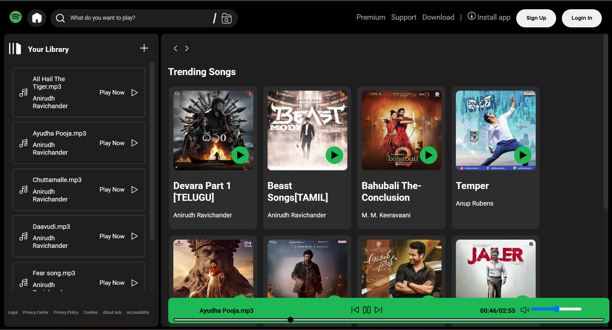

# 🎵 Spotify Clone

A responsive and interactive Spotify web UI clone built using **HTML**, **CSS**, and **JavaScript**. This project replicates the core look and feel of Spotify’s desktop interface, including music cards, a sidebar library, and a functional footer music bar.

## 🚀 Features

- 🎧 Music library section with song names and artists
- 🔥 Trending songs section with album art
- ▶️ Play buttons on each track and album
- 🎛️ Seek bar and volume control in the bottom music player
- 🎨 Clean Spotify-inspired dark theme
- 💡 Responsive design for different screen sizes

## 🛠️ Built With

- HTML5
- CSS3 (Flexbox, Custom Scrollbars)
- JavaScript
